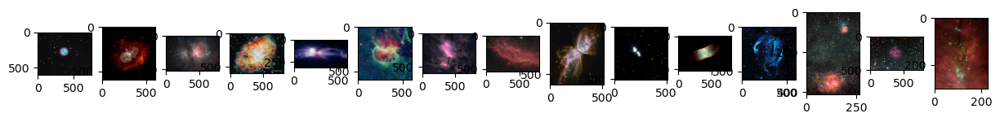
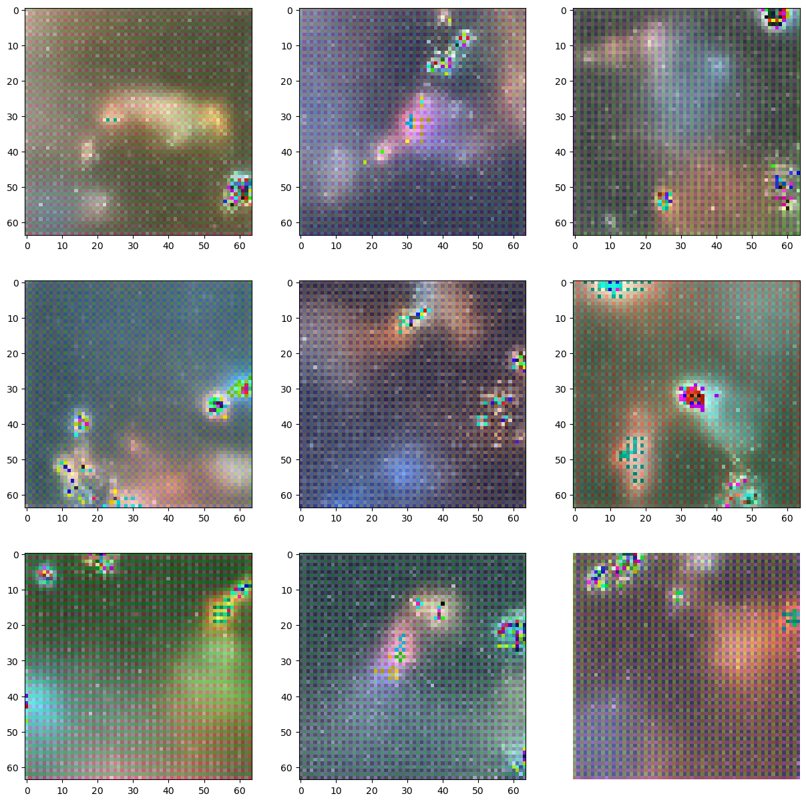

# Gotta_Diffuse_Em-All
This is a trained basic diffusion model that generates non - existing nebula images. This model is made by referring to DDPM paper.

## Samples images from the dataset
These are the sample images from the dataset that the model is trained on.

## Forward Diffusion
Forward diffusion is a process that basically destroies the image by adding noise. It can be thought of iike a markov chain process as the diffused image at time T + 1 depends on the image at time T. This is the visual representation of adding the noise to the image till it is completely destroyed.

## Reverse Diffusion (using U-Net model)
The U-Net model is trained on the diffused images to predict the noise in that image. The information about the timestamp is also added to the image by adding T in the form of Sinosidal Embedding. The graph below is the loss graph of the model till 200 epochs.

## Generated Outputs
These are some of the generated outputs after the training. 

## Improvements 
- Diffusing the latent space instead of the actual image to reduce computations and get much clearer images
- Add Conditioning to fine-tune it and get better results 
